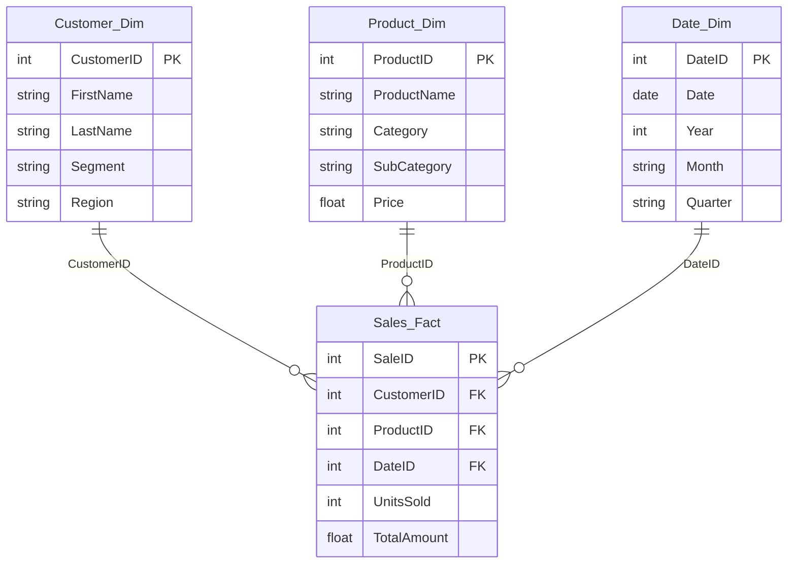

<div align="center">

# Sales & Customer Intelligence Dashboard

**An interactive Power BI report for analyzing sales performance, product and customer rankings, category mix, and regional trends.**

<br>


<br>

[Overview](#overview) &nbsp;·&nbsp; [KPIs](#key-kpis) &nbsp;·&nbsp; [Features](#key-features) &nbsp;·&nbsp; [Data Model](#data-model) &nbsp;

<br>

<!-- [Add Screenshot]: export the Main page from Power BI as assets/dashboard-main.png -->


</div>

---

## Overview

The Sales & Customer Intelligence Dashboard is a five-page Power BI report built on a transactional sales dataset covering 1,000 transactions, 200 customers, 100 products across three categories (Furniture, Office Supplies, Technology), and 4 regions (North, South, East, West), spanning June 2024 – June 2025.

At its core, this project addresses a common analytical challenge: sales, customer, and product data are usually captured as flat transactional records, but the real business value comes from being able to slice that data by time, region, category, and customer segment — and to move between a high-level summary and a detailed drill-down without switching tools.

I built this dashboard to bring together four data domains that are normally analyzed separately:

Sales performance — how total revenue and order volume are trending
Product performance — which categories and individual products are driving results
Customer performance — which customers contribute the most, and how consistently
Regional performance — how the four regions compare against each other

Analyzing these together matters because in a real sales organization, none of these questions can be answered in isolation. A sales lead asking "why did North underperform this quarter" needs to see the product mix, the customer base, and the time trend for that region simultaneously — not four separate spreadsheets.

Power BI is used here specifically for its ability to combine data modeling (relating multiple tables into a single queryable model), DAX (custom business calculations), and interactive visuals into one connected report, so that a single click on a slicer or chart updates every visual on the page consistently.

Who this is for: sales leads, category/product managers, and account teams who need a fast, filterable view of performance without writing queries or building pivot tables manually.

What decisions it supports: identifying which categories and products to prioritize, spotting underperforming regions, recognizing top-contributing customers worth retaining, and understanding whether sales are trending up, down, or flat over a selected period.

---

### Landing Page


> Purpose: Serve as the single entry point into the report.
What I implemented: Four numbered navigation buttons, each linked to a bookmark for its target page. Key visuals: Static title/branding elements and the four navigation buttons.
Business questions answered: "Where do I go to see what I need?" — this page exists purely for orientation, not analysis.

### Sales Analysis Dashboard (Main)


> Purpose: Give a consolidated, top-level view of overall sales performance. 
What I implemented: Total Sales, Total Order, and High Sales cards; a KPI visual comparing Total Sales to the High Sales goal; a Total Sales by Category donut; a Total Sales by Region column chart; a Total Sales trend line with trend line and max/min reference lines; a date-range slicer. Key visuals: KPI cards, KPI visual, donut chart, column chart, trend line chart. 
Business questions answered: "How are we doing overall right now, are we ahead of our benchmark, which category and region are leading, and how has sales volume trended over the selected period?"

### Detailed Product Analysis


> Purpose: Let a product or category manager dig into product-level performance. 
What I implemented: A Top 10 Product list; a Top 5 Products by Sales bar chart ranked on YTD sales; a monthly sales-by-category line chart; a category donut; a monthly summary table (Total Order, Total Sales, Avg Sales, First Category); a combined Year/Region/Segment filter. Key visuals: Ranked bar chart, category line chart, donut, summary table. 
Business questions answered: "Which products and categories are leading this year, how does category performance move month to month, and how does that change when I filter to a specific year, region, or segment?"

### Detailed Customer Analysis


> Purpose: Let a sales lead or account team identify and understand top-contributing customers. 
What I implemented: Total Sales, Total Order, and Avg Sales cards; a Top 10 Customer table (Full Name, Total Order, Sum of Total Amount); a Top 5 Customer bar chart; a Total Sales by Month trend line; a category donut; a monthly breakdown table by category. Key visuals: Cards, ranked customer table, ranked bar chart, trend line, donut. 
Business questions answered: "Who are our most valuable customers, how many orders do they place versus how much they spend, and how does customer-driven sales move across the year?"

### Drillthrough Page


> Purpose: Provide a detailed, date-hierarchy-driven view for a specific point of interest selected elsewhere in the report.
What I implemented: A combo chart of Sum of Total Amount and Sum of Units Sold plotted by quarter, built on the Year › Quarter › Month › Day hierarchy, with drillthrough configured and Keep all filters enabled. Key visuals: Combo (column + line) chart. 
Business questions answered: "For the specific period or item I clicked on, what's the detailed breakdown of value versus volume, down to the quarter or day level

### Analytics Performed

### Sales Analysis

Total Sales, Total Order, and High Sales cards plus the KPI visual and the Main-page trend line show overall sales value, volume, and how current performance compares to a set benchmark, with the ability to filter to a custom date range.

### Customer Analysis

The Top 10 Customer table and Top 5 Customer bar chart, combined with Total Order/Avg Sales, show which customers contribute the most value, how many orders they place, and how that compares to their average order size.

### Product Analysis

The Top 10 Product slicer, Top 5 Products by Sales (YTD-ranked) chart, and the monthly-by-category line chart show which products and categories are performing best, and how that performance moves through the year.

### Regional Analysis

The Total Sales by Region column chart on the Main page shows how North, South, East, and West compare on total sales value; the Year/Region/Segment filter on the Product page lets that comparison be applied to product-level data as well.

### Time Analysis

The Main-page trend line (with max/min reference lines), the Product page's monthly-by-category chart, the Customer page's monthly trend, and the Drillthrough page's quarter-level combo chart together show how sales move over time at multiple levels of granularity — from a full-period trend down to a single quarter's detail.

### Return Analysis

Not currently performed — Returns_Fact exists in the data model and is related to Sales_Fact, but no dedicated returns visual or page has been built yet (documented as a future enhancement).

---

## Key KPIs

| KPI | Purpose |
|---|---|
| **Total Sales** | Overall sales value. Shown on the Main and Customer pages and used across most charts. |
| **Total Order** | Order volume. Shown on the Main, Product and Customer pages. |
| **High Sales** | Benchmark card on the Main page, also used as the goal in the KPI visual. [Add Details: exact definition] |
| **Avg Sales** | Average sales value, shown on the Customer page and in the Product and Customer tables. |
| **Total Sales YTD** | Year-to-date sales, used to rank the Top 5 products on the Product page. |
| **Total Amount / Units Sold** | Summed sales amount and quantity, used in the customer tables and the Drillthrough combo chart. |

---

## Key Features

| Feature | Implementation |
|---|---|
| **Multi-page navigation** | Landing page with four buttons wired to bookmarks for each report page |
| **KPI monitoring** | Cards plus a KPI visual comparing Total Sales against the High Sales goal |
| **Sales trend analysis** | Line chart with a trend line and max/min reference lines; average reference lines on the Product and Customer pages |
| **Top-N analysis** | Top 10 products, Top 5 products by YTD sales, Top 10 customers, Top 5 customers |
| **Product performance** | Category donut, category trend by month, product ranking, product slicer |
| **Customer analysis** | Ranked customer table and chart, customer-level totals and averages |
| **Regional analysis** | Total Sales by Region chart; Region and Segment filters on the Product page |
| **Time intelligence** | Year-to-date sales measure and a Year › Quarter › Month › Day date hierarchy for drill-down |
| **Interactive filters** | Date-range slicer (Main); Year / Region / Segment dropdowns and a product slicer (Product page) |
| **Mobile layout** | Phone-optimized layout for the Main page |

---

## Data Model

The model follows a fact–dimension structure: three dimensions filter the `Sales_Fact` table.



| Table | Type | Description |
|---|---|---|
| `Sales_Fact` | Fact | One row per sale: customer, product, date, units sold, total amount |
| `Returns_Fact` | Fact | Return records with reason and return date. [Add Details: relationship in Model view] |
| `Customer_Dim` | Dimension | Customer name, email, segment (Consumer / Corporate / Home Office), region. Includes a calculated `FULL NAME` column |
| `Product_Dim` | Dimension | Product name, category, sub-category, price |
| `Date_Dim` | Dimension | Date, year, month, quarter |
| `Region_Dim` | Dimension | Region name and regional manager. [Add Details: relationship in Model view] |
| `Date Range`, `Date Range 2` | Supporting | [Add Details: purpose] |

<!-- [Add Screenshot]: Model view as assets/data-model.png -->


---

## DAX Measures

| Measure | Table | Used in |
|---|---|---|
| `TOTAL SALES` | `Sales_Fact` | Cards, KPI visual, and nearly every chart |
| `TOTAL ORDER` | `Sales_Fact` | Cards, Product and Customer tables |
| `HIGH SALES` | `Sales_Fact` | Main card, KPI goal |
| `AVG SALES` | `Sales_Fact` | Customer card, Product and Customer tables |
| `TOTAL SALES YTD` | `Date_Dim` | Ranking for the Top 5 Products chart |

<!-- [Add Details]: paste the DAX for each measure below -->

```DAX
TOTAL SALES     = [Add DAX]
TOTAL ORDER     = [Add DAX]
HIGH SALES      = [Add DAX]
AVG SALES       = [Add DAX]
TOTAL SALES YTD = [Add DAX]
```

---

## User Journey

1. Open the report and land on the navigation page.
2. Click a numbered button to jump via bookmark to the desired page.
3. On the Main page, review the Total Sales, Total Order, and High Sales cards and the KPI visual against the goal.
4. Adjust the date-range slicer to focus on a specific period and watch every Main-page visual update.
5. Move to Detailed Product Analysis, apply the Year/Region/Segment filter or the Top 10 Product slicer, and review the YTD-ranked Top 5 Products chart.
6. Move to Detail Customer Analysis to see the Top 10 Customer table and Top 5 Customer chart, and compare Total Order against Avg Sales.
7. Right-click a data point to use drillthrough, landing on the Drillthrough page's combo chart with existing filters carried over.
8. Drill down through the Year › Quarter › Month › Day hierarchy on that combo chart to inspect value and volume at a finer grain.
9. Return to the Main page or navigation page to compare findings across regions, categories, or time periods.
---
## What I Learned

Building this project, I worked through the practical parts of a Power BI build that don't show up until you actually connect the pieces:

### * Data modeling :—

-> I learned how relationship cardinality and filter direction between fact and dimension tables actually determine whether a slicer on one page behaves correctly on every visual, not just the one it's placed next to.

### * DAX :— 

-> writing TOTAL SALES YTD specifically taught me the difference between a measure that aggregates a column and one that has to respect a time-based filter context correctly to rank products fairly.

### * Time intelligence :—

-> I saw firsthand why a proper Date_Dim table (rather than relying on a raw date column) is what makes hierarchy-based drill-down and YTD calculations possible at all.

### * Dashboard design :—

-> deciding which chart belonged on which page (rankings as bars, mix as a donut, trend as a line, value-vs-volume as a combo chart) reinforced that chart choice should follow the question, not personal preference.

### *Navigation and UX :—

-> building the bookmark-linked landing page showed me how much a proper entry point changes whether a report feels finished versus feels like a set of disconnected tabs.

### Scoping honestly :—

-> documenting Returns analysis and Row-Level Security as future enhancements rather than implemented features was itself a useful exercise in being precise about what a project actually delivers versus what it could deliver next.

---
## Tech Stack

| Tool | Use |
|---|---|
| **Power BI Desktop** | Data model, report design, navigation, mobile layout |
| **DAX** | Measures and the calculated `FULL NAME` column |
| **Microsoft Excel** | Source workbook (`FinalProject_Dataset.xlsx`) with six tables |

---

## Repository Structure

```text
├── Sales_Customer_Intelligence_Dashboard.pbix
├── data/
│   └── FinalProject_Dataset.xlsx
├── assets/                      ← screenshots to add
│   ├── landing-page.png
│   ├── dashboard-main.png
│   ├── product-analysis.png
│   ├── customer-analysis.png
│   ├── drillthrough-page.png
│   ├── mobile-view.png
│   └── data-model.png
└── README.md
```

## Author

**Meet Dodiya** · Data Analyst

[LinkedIn](https://www.linkedin.com/in/meet-dodiya-1031a6402/) &nbsp;·&nbsp; [GitHub](https://github.com/MEET-0811) &nbsp;·&nbsp; meetdodiya0811@gmail.com
