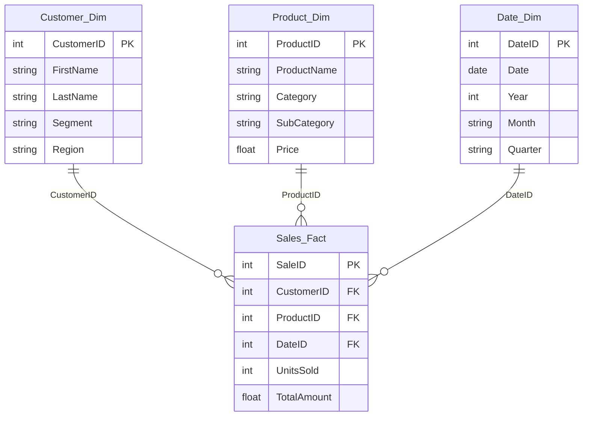

<div align="center">

# 📊 Sales & Customer Intelligence Dashboard

**An interactive Power BI report for analyzing sales performance, product and customer rankings, category mix, and regional trends.**

<br>


<br>

[Overview](#overview) &nbsp;·&nbsp; [Dashboard Preview](#dashboard-preview) &nbsp;·&nbsp; [KPIs](#key-kpis) &nbsp;·&nbsp; [Features](#key-features) &nbsp;·&nbsp; [Data Model](#data-model) &nbsp;·&nbsp; [Getting Started](#getting-started)

<br>

<!-- [Add Screenshot]: export the Main page from Power BI as assets/dashboard-main.png -->


</div>

---

## Overview

The Sales & Customer Intelligence Dashboard is a five-page Power BI report built on a transactional sales dataset covering 1,000 transactions, 200 customers, 100 products across three categories (Furniture, Office Supplies, Technology), and 4 regions (North, South, East, West), spanning June 2024 – June 2025.

At its core, this project addresses a common analytical challenge: sales, customer, and product data are usually captured as flat transactional records, but the real business value comes from being able to slice that data by time, region, category, and customer segment — and to move between a high-level summary and a detailed drill-down without switching tools.

I built this dashboard to bring together four data domains that are normally analyzed separately:

Sales performance — how total revenue and order volume are trending
Product performance — which categories and individual products are driving results
Customer performance — which customers contribute the most, and how consistently
Regional performance — how the four regions compare against each other

Analyzing these together matters because in a real sales organization, none of these questions can be answered in isolation. A sales lead asking "why did North underperform this quarter" needs to see the product mix, the customer base, and the time trend for that region simultaneously — not four separate spreadsheets.

Power BI is used here specifically for its ability to combine data modeling (relating multiple tables into a single queryable model), DAX (custom business calculations), and interactive visuals into one connected report, so that a single click on a slicer or chart updates every visual on the page consistently.

Who this is for: sales leads, category/product managers, and account teams who need a fast, filterable view of performance without writing queries or building pivot tables manually.

What decisions it supports: identifying which categories and products to prioritize, spotting underperforming regions, recognizing top-contributing customers worth retaining, and understanding whether sales are trending up, down, or flat over a selected period.
---

## Dashboard Preview

### Landing Page

<!-- [Add Screenshot]: assets/landing-page.png -->


> Entry point of the report. Four numbered buttons navigate to the Main dashboard, Detailed Product Analysis, Detailed Customer Analysis, and the Drillthrough page.

### Sales Analysis Dashboard (Main)

<!-- [Add Screenshot]: assets/dashboard-main.png -->


> Consolidated sales view with Total Sales, Total Order and High Sales cards, a KPI visual, Total Sales by product category and by region, and a Total Sales trend over time with trend line and max/min reference lines. A date-range slicer filters the page.

### Detailed Product Analysis

<!-- [Add Screenshot]: assets/product-analysis.png -->


> Product-level view with a Top 10 product slicer, a Top 5 Products by Sales bar chart (ranked on year-to-date sales), monthly sales by category, a category donut, and a summary table of orders, total sales and average sales. Year, Region and Segment filters sit at the top right.

### Detailed Customer Analysis

<!-- [Add Screenshot]: assets/customer-analysis.png -->


> Customer-level view with Total Sales, Total Order and Avg Sales cards, a Top 10 Customer table, a Top 5 customer bar chart, a monthly sales trend, category mix, and a month/day breakdown table.

### Drillthrough Page

<!-- [Add Screenshot]: assets/drillthrough-page.png -->


> A combo chart of Total Amount and Units Sold across the date hierarchy (Year › Quarter › Month › Day).

### Mobile Layout

<!-- [Add Screenshot]: assets/mobile-view.png (Power BI Desktop > View > Mobile layout) -->


> A phone layout is configured for the Main page: the three KPI cards, KPI visual, sales trend, category donut, and regional column chart.

---

## Key KPIs

| KPI | Purpose |
|---|---|
| **Total Sales** | Overall sales value. Shown on the Main and Customer pages and used across most charts. |
| **Total Order** | Order volume. Shown on the Main, Product and Customer pages. |
| **High Sales** | Benchmark card on the Main page, also used as the goal in the KPI visual. [Add Details: exact definition] |
| **Avg Sales** | Average sales value, shown on the Customer page and in the Product and Customer tables. |
| **Total Sales YTD** | Year-to-date sales, used to rank the Top 5 products on the Product page. |
| **Total Amount / Units Sold** | Summed sales amount and quantity, used in the customer tables and the Drillthrough combo chart. |

---

## Key Features

| Feature | Implementation |
|---|---|
| **Multi-page navigation** | Landing page with four buttons wired to bookmarks for each report page |
| **KPI monitoring** | Cards plus a KPI visual comparing Total Sales against the High Sales goal |
| **Sales trend analysis** | Line chart with a trend line and max/min reference lines; average reference lines on the Product and Customer pages |
| **Top-N analysis** | Top 10 products, Top 5 products by YTD sales, Top 10 customers, Top 5 customers |
| **Product performance** | Category donut, category trend by month, product ranking, product slicer |
| **Customer analysis** | Ranked customer table and chart, customer-level totals and averages |
| **Regional analysis** | Total Sales by Region chart; Region and Segment filters on the Product page |
| **Time intelligence** | Year-to-date sales measure and a Year › Quarter › Month › Day date hierarchy for drill-down |
| **Interactive filters** | Date-range slicer (Main); Year / Region / Segment dropdowns and a product slicer (Product page) |
| **Mobile layout** | Phone-optimized layout for the Main page |

---

## Data Model

The model follows a fact–dimension structure: three dimensions filter the `Sales_Fact` table.



| Table | Type | Description |
|---|---|---|
| `Sales_Fact` | Fact | One row per sale: customer, product, date, units sold, total amount |
| `Returns_Fact` | Fact | Return records with reason and return date. [Add Details: relationship in Model view] |
| `Customer_Dim` | Dimension | Customer name, email, segment (Consumer / Corporate / Home Office), region. Includes a calculated `FULL NAME` column |
| `Product_Dim` | Dimension | Product name, category, sub-category, price |
| `Date_Dim` | Dimension | Date, year, month, quarter |
| `Region_Dim` | Dimension | Region name and regional manager. [Add Details: relationship in Model view] |
| `Date Range`, `Date Range 2` | Supporting | [Add Details: purpose] |

<!-- [Add Screenshot]: Model view as assets/data-model.png -->


---

## DAX Measures

| Measure | Table | Used in |
|---|---|---|
| `TOTAL SALES` | `Sales_Fact` | Cards, KPI visual, and nearly every chart |
| `TOTAL ORDER` | `Sales_Fact` | Cards, Product and Customer tables |
| `HIGH SALES` | `Sales_Fact` | Main card, KPI goal |
| `AVG SALES` | `Sales_Fact` | Customer card, Product and Customer tables |
| `TOTAL SALES YTD` | `Date_Dim` | Ranking for the Top 5 Products chart |

<!-- [Add Details]: paste the DAX for each measure below -->

```DAX
TOTAL SALES     = [Add DAX]
TOTAL ORDER     = [Add DAX]
HIGH SALES      = [Add DAX]
AVG SALES       = [Add DAX]
TOTAL SALES YTD = [Add DAX]
```

---

## Key Insights

[Add Details: 3–4 findings you observed in the finished dashboard, e.g. leading category, strongest region, top customer or product, and the overall sales trend.]

---

## Tech Stack

| Tool | Use |
|---|---|
| **Power BI Desktop** | Data model, report design, navigation, mobile layout |
| **DAX** | Measures and the calculated `FULL NAME` column |
| **Microsoft Excel** | Source workbook (`FinalProject_Dataset.xlsx`) with six tables |

---

## Repository Structure

```text
├── Sales_Customer_Intelligence_Dashboard.pbix
├── data/
│   └── FinalProject_Dataset.xlsx
├── assets/                      ← screenshots to add
│   ├── landing-page.png
│   ├── dashboard-main.png
│   ├── product-analysis.png
│   ├── customer-analysis.png
│   ├── drillthrough-page.png
│   ├── mobile-view.png
│   └── data-model.png
└── README.md
```

---

## Getting Started

1. Clone or download this repository.
2. Open `Sales_Customer_Intelligence_Dashboard.pbix` in **Power BI Desktop**.
3. If prompted for the data source, point it to `data/FinalProject_Dataset.xlsx` via **Transform data → Data source settings**.
4. Start on the landing page and use the numbered buttons to move between pages.

---

## Future Enhancements

- A returns analysis page using `Returns_Fact` (return reasons and return trends)
- Region-based row-level security using the regional manager data in `Region_Dim`
- Custom tooltip pages with mini visual summaries

---

## Author

**Meet Dodiya** · Data Analyst

[LinkedIn](https://www.linkedin.com/in/meet-dodiya-1031a6402/) &nbsp;·&nbsp; [GitHub](https://github.com/MEET-0811) &nbsp;·&nbsp; meetdodiya0811@gmail.com
